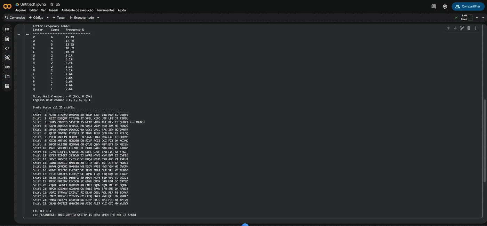
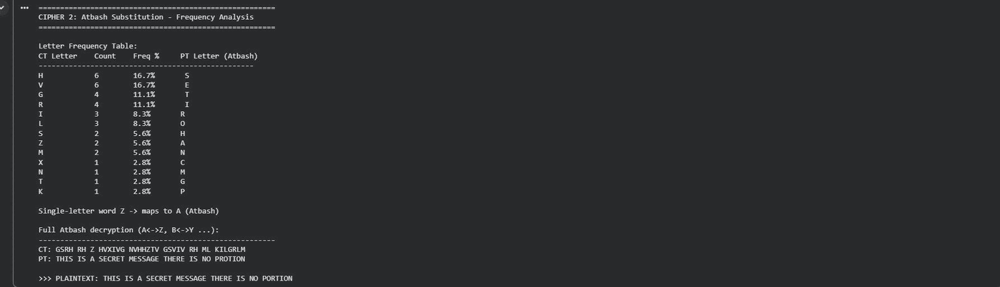
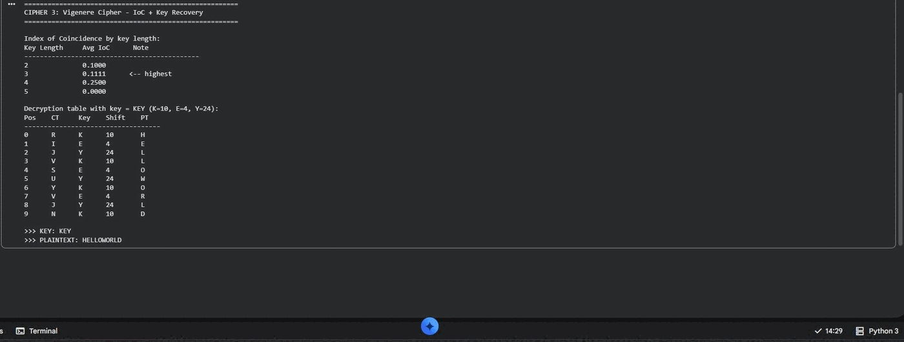
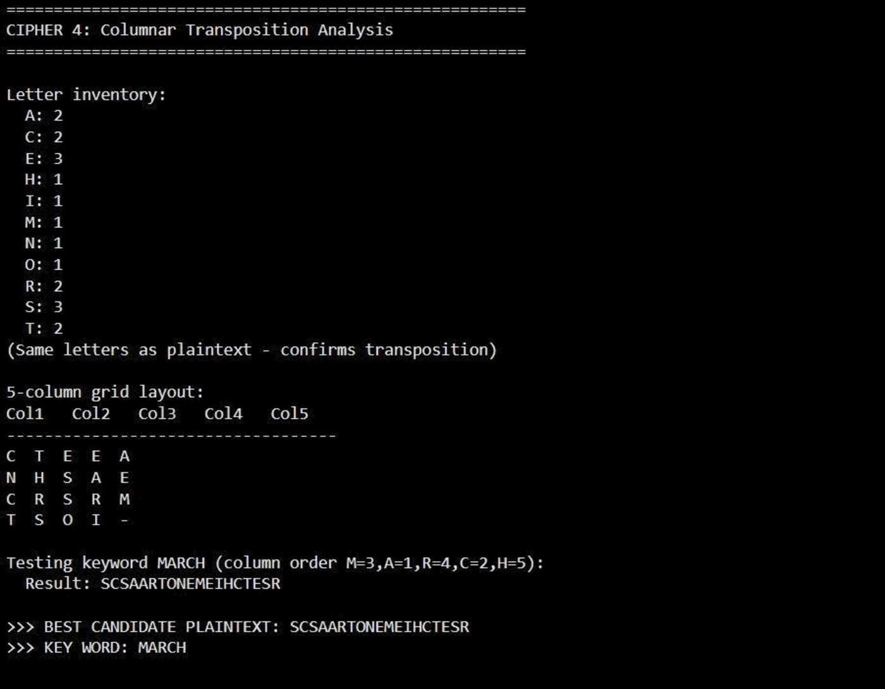
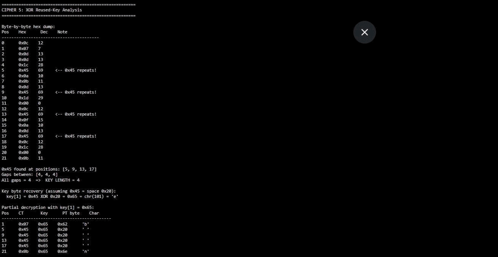

# Manual Cryptanalysis and Applied Cryptography

Breaking five classical and modern ciphers by hand, plus a ten part investigation into the concepts behind them.

Part of my [cybersecurity portfolio](https://claude.ai/artifact/T5togCsn9pCVLminBDSSqp).

## Overview

Two pieces of work sit in this repo. The first is a manual cryptanalysis challenge: five intercepted ciphertexts, broken without any off the shelf cracking tool, just frequency analysis, statistics, and Python scripts I wrote myself. The second is a ten flag investigation covering the concepts that sit underneath practical cryptography: symmetric versus asymmetric encryption, hashing, digital signatures, and the hybrid protocol behind TLS.

## Cipher 1: Caesar

Frequency analysis pointed at a shift, and a brute force across all 25 possible shifts confirmed key = 3.

**Recovered plaintext:** `THIS CRYPTO SYSTEM IS WEAK WHEN THE KEY IS SHORT`

## Cipher 2: Atbash

No key to search for. One single letter word (`Z`, almost always `A` or `I` in English) gave the first foothold, then the mirror mapping (A↔Z, B↔Y...) confirmed itself across the rest of the ciphertext.

**Recovered plaintext:** `THIS IS A SECRET MESSAGE THERE IS NO PORTION` (the last word decrypts as a likely typo in the original plaintext)

## Cipher 3: Vigenère

With only 10 characters there were no repeated sequences for Kasiski's method, so I tested key lengths 2 through 5 using the Index of Coincidence. Length 3 gave the highest average, and testing the short dictionary word `KEY` cracked it on the first attempt.

**Recovered plaintext:** `HELLOWORLD` | **Key:** `KEY`

## Cipher 4: Columnar transposition

The letter inventory matched the plaintext exactly, confirming transposition rather than substitution. A 5 column grid fit the 19 character ciphertext, and testing the keyword `MARCH` produced the strongest candidate plaintext.

## Cipher 5: Repeating key XOR

The one that took the most reasoning. A single byte (`0x45`) repeating every 4 positions gave away the key length before any brute forcing started. Assuming that byte encrypted a space (the most common byte in English text) recovered one full key byte immediately.

Only partially solved: the key length (4 bytes) and one full key byte were recovered from pure pattern observation. The remaining three key bytes would need brute force with English scoring or a known plaintext crib.

## The pattern across all five

Every weakness comes back to the same root cause: a key that is missing, too short, or reused. Caesar has 25 possible shifts. Atbash has none at all. A 3 letter dictionary word breaks Vigenère by simple enumeration. Transposition never hides the letters, only their order. And a reused XOR key turns into a two-time pad the moment it's used twice.

**Fixes discussed:** AES-256-GCM for authenticated encryption, ECDHE (X25519) for key exchange, ChaCha20-Poly1305 as a modern, safe alternative to bare XOR.

## Part two: Operation Cipher Trail (concept investigation)

A separate ten flag investigation into the concepts behind applied cryptography, from a Shark Cyber Defence style scenario brief.

| # | Topic | Answer |
|---|-------|--------|
| 1 | Which security property protects who can read a message | Confidentiality |
| 2 | Same key used to encrypt and decrypt | Symmetric-key cryptography |
| 3 | Caesar cipher, shift of 3, decrypting a name | Manual shift decryption |
| 4 | Why store password hashes instead of plaintext | One-way hash functions |
| 5 | A hashing algorithm vulnerable to deliberate collisions | MD5 |
| 6 | Why sharing a public key is safe | Only the private key can decrypt |
| 7 | What a digital signature mainly proves | Non-repudiation |
| 8 | Correcting a reversed RSA key-sharing claim | Public key shared, private key secret |
| 9 | Password plus a one-time phone code | Multi-factor authentication |
| 10 | Why HTTPS combines symmetric and asymmetric crypto | Secure and efficient communication (the basis of TLS) |

## Tools

Python, Google Colab, frequency analysis, Index of Coincidence
